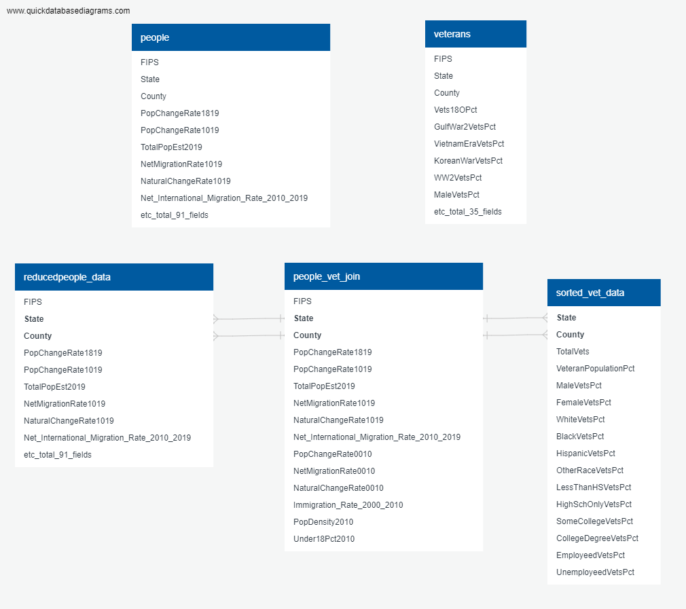

---
---

## Topic
#### Our broad focus is on Veterans. Ron and Fritz both have deep roots in the military. Ron's grandfather, father and uncle are veterans. Ron attended military school and worked as a chaplain for a homeless shelter. Fritz is a third-generation veteran who served four years in the United States Air Force. He is interested in recruitment demographics, active duty family life, and veterans issues. Stacey's father is a veteran and she has provided in person and telephonic nursing services to many veterans over the years. Initially, we talked about veterans and access to healthcare but after looking at the data, we have changed course and will be analyzing historical data to predict what locations are likely to have a higher enlistment percentage over the next 5 years. Our presentation can be found on [Google Slides](https://docs.google.com/presentation/d/1b4TqI5O1TyGiAnAd81aO9kn2H9gLy619/edit?usp=sharing&ouid=108898461153543117314&rtpof=true&sd=true).

## Data
#### We retrieved data from Kaggle including census details on a variety of categories in rural areas by county in the US for 2010-2019. The data came from a variety of Federal sources with detailed descriptions of each category located on the USDA's website. The information is divided into four main groups; people, veterans, income and jobs, with hundreds of sub-categories for each county including population, ethnicity, unemployment and retirement data. Ron cleaned the data, sorted the columns and created dataframes which he then exported into csv files. Fritz imported the data and created tables for county classification, income, jobs, people and veterans. Ron added longitude and latitude for each state to use for visualization and created visualizations of the data with interactive features using [Tableau](https://public.tableau.com/app/profile/ronald.w.bingham/viz/FinalProject_16450225195590/VeteranData).

---
---

## Machine Learning Model
#### What type of model and why? We plan to start with multiple linear regression and compare the results with ridge and lasso regression if needed since we are looking for predictive trends not classifications. We are considering deep learning, neural networks. 
#### Preliminary data preprocessing:  We will remove rows that show data for US and data for state and county where state and county are the same and scale the data due to the wide range of numerical data. This will be done before feature engineering and selection.
#### Preliminary feature engineering and feature selection including decision making process: We plan to utilize Random Forest Regression to demonstrate feature importance, use a plot and/or heatmap to show correlation. At this point, we have outlines for linear, lasso and ridge regression as well as neural networks. We are in the process of refactoring code and plan to add in our data to start testing this week. 
#### Description of how data was split into training and testing sets: We split the data using Total Veteran population as our target and keeping education, employment, race and gender as our features. 
#### Explanation of model choice including limitations and benefits: We chose linear regression as our predictive model to classify trends in veteran population. 
#### How are you training your model? After splitting into train and test, scaling and fitting the data, running it through linear, lasso and ridge regression models, we ran into a problem. 
#### What is your model's accuracy? Our accuracy score was 0.99...we looked back at our data and realized that we do not have the details needed for train and test. We are training against a dataset that does not actually provide a way to differentiate between a veteran and a civilian. We are now in the process of finding data that will allow us to make a prediction. We have the framework in place and hope to find data to run through that framework.
#### How does this model work?

---
---

## Database

### Database ERD

**Note:** This ERD does not include utility tables holding intermediary data (e.g., the table dump of an encoded dataframe). There may also be more tables to add when we have a clearer picture of what we will use for our presentation.

### Postgres hosted on Amazon Web Services.

- **Server Name**: shrbfk-final-project

- **Initial Database**: vet_data

- **Endpoint**: shrbfk-final-project.cuitpsvagrne.us-east-2.rds.amazonaws.com

- **Port**: 5432

- **Security Group**: default (sg-06938851ed8d02d68)

---
---

## Technologies Used
#### Data Cleaning and Analysis: Pandas, Jupyter Notebook, SQL
#### Database Storage: AWS, Postgres
#### Machine Learning: SciKit Learn Library, Tensorflow
#### Dashboard: We plan to use Heroku, Bootstrap CSS, HTML, JS for our dashboard with interactive elements/maps included in Tableau and potentially the website as well. The interactive elements will allow the user to view the veteran population, historical and predicted, based on geographical location. 

### Website
[Final Project - Enlistment Trends](https://phritspetpals.herokuapp.com/)

##### Contributions: We choose to work and present as a group, with each of us contributing equal time and effort. We acknowledge that this will result in a group grade for this final project. 
